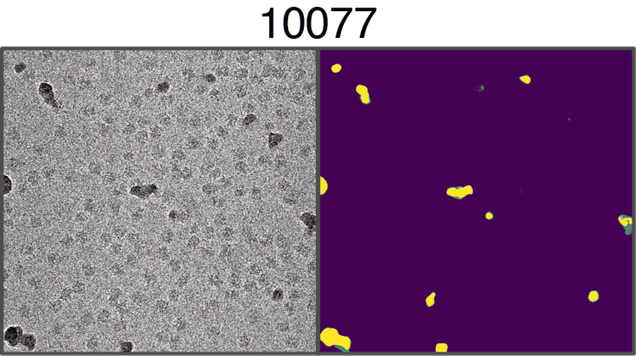
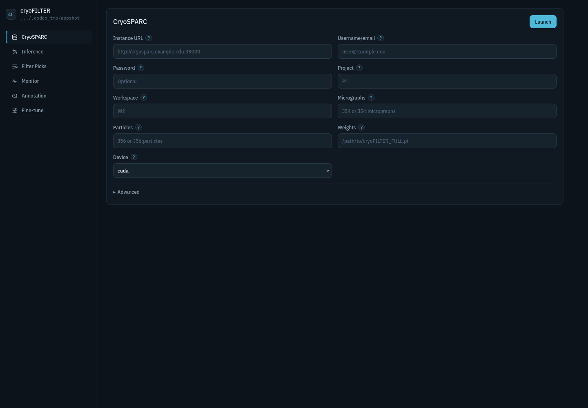

# cryoFILTER

**An easy-to-use cryo-EM contamination segmentation and particle-filtering application with direct cryoSPARC integration, built-in annotation, and dataset-specific fine-tuning.**



cryoFILTER detects contaminated regions in cryo-EM micrographs, optionally removes nearby particle picks, and can label contamination as Carbon, Crystalline, Aggregate, or Ethane. The recommended interface is the local browser app; command-line tools remain available for scripting and expert workflows.

## Overview

Automated cryo-EM data collection increasingly produces datasets in which useful particle images coexist with carbon, crystalline ice, aggregates, support material, residual ethane, and other non-particle signal. The important decision is often local: retain usable regions of a micrograph while excluding contaminated regions before they propagate into picking, classification, and refinement.

cryoFILTER combines real-space image information with Fourier-derived features and non-local context to identify contaminated regions while preserving surrounding particle-containing ice. The resulting masks can remove nearby particle picks without discarding the whole exposure, and optional subtype diagnostics help identify the physical contamination source.

## What It Does

- Predicts contamination probability maps and binary masks from motion-corrected micrographs.
- Filters CryoSPARC `.cs/.csg` or RELION `.star` particle picks using predicted or existing masks.
- Pushes filtered particle splits and diagnostic plots back to CryoSPARC when credentials are provided.
- Provides browser-native annotation and session resume without Qt, X forwarding, or a desktop GUI.
- Launches the recommended full-micrograph fine-tuning recipe from saved annotations.

cryoFILTER does not modify raw micrographs or input particle files.

## Install

```bash
git clone https://github.com/Under-Refinement/cryoFILTER.git
cd cryoFILTER
conda env create -f environment.yml
conda activate cryofilter
python -m pip install -e .
cryoFILTER install-cryosparc-tools
```

The CryoSPARC Tools helper shows a command-line version menu. Select your
CryoSPARC server minor version, such as `5.0` for CryoSPARC `5.0.x` or `4.7`
for CryoSPARC `4.7.x`, and it installs the matching `cryosparc-tools` package.
Press Enter to skip matching and install the latest `cryosparc-tools` release;
the helper will warn that Tools should match the server minor version.

For scripted installs, pass the version directly:

```bash
cryoFILTER install-cryosparc-tools --cryosparc-version 5.0
```

The noninteractive extra remains available when you deliberately want pip to
install the latest available Tools package:

```bash
python -m pip install -e ".[cryosparc-bridge]"
```

Download the released `cryoFILTER_FULL.pt` checkpoint from Zenodo:

```text
https://zenodo.org/records/19560722
```

Then place the file here:

```text
pretrained_models/cryoFILTER_FULL.pt
```

Use `python -m pip install -e .` without the helper if you do not need CryoSPARC integration. If your cluster requires a specific CUDA build, install the matching PyTorch and torchvision packages before installing cryoFILTER.

The browser app and browser-native Annotation tab do not require Qt. Install the optional desktop GUI fallback only if you want the older matplotlib window:

```bash
python -m pip install -e ".[gui]"
```

## Launch The App

Run the app from the directory where you want logs and relative outputs written:

```bash
cd /path/to/project-or-output-directory
cryoFILTER app
```

Open this URL in a browser:

```text
http://127.0.0.1:8765/
```

For a remote processing server, open the SSH session with local port forwarding first:

```bash
ssh -L 8765:127.0.0.1:8765 user@processing-server
cd /path/to/project-or-output-directory
cryoFILTER app
```

Then open `http://127.0.0.1:8765/` on your laptop. If the app uses a different port, the `-L` port and browser URL must match that port.

Very important: launch the app inside a persistent `screen` session so jobs keep running if you close the browser or disconnect:

```bash
screen -S cryofilter
cd /path/to/project-or-output-directory
cryoFILTER app
```

Detach with `Ctrl-a d`. The browser can be closed and revisited whenever as long as the app server is still running. If you stop the app server or close the terminal running it, the app cannot reliably reconnect to jobs that were running while it was closed; restart the SSH tunnel and reattach with `screen -r cryofilter` to keep the same app alive.

The lowercase command is equivalent:

```bash
cryofilter app
```



## Main Workflows

**CryoSPARC:** Connect with the CryoSPARC instance URL, username/email, and password in the app. Then provide project/workspace IDs, a micrograph output such as `J54` or `J54:micrographs`, a particle output such as `J56` or `J56:particles`, and the checkpoint path. The app creates a CryoSPARC External Job with accepted/rejected particles and diagnostics.

The CryoSPARC form exposes **CPUs**, **Typing workers**, and **Typing updates**. Live background typing reuses per-image features while inference continues; Final only starts typing after inference. An explicit CPU budget is shared between inference and live typing, and a one-CPU budget uses final-only typing. The monitor reports completed inference images and typed images separately, with finalization and upload shown as distinct phases.

**Mask generation:** Use Inference with micrographs, weights, and an output directory. Particles are optional, so this can generate masks only.

**Particle filtering:** Use Filter Picks when masks already exist and you want to filter new or re-exported particle picks without rerunning inference.

**Annotation:** Use Annotation with a local micrograph path, a CryoSPARC micrograph output, or a previous `manifest_edited.csv`. Sessions can be saved and resumed in the browser.

**Fine-tuning:** Use Fine-tune after annotation. If Train IDs and Val IDs are blank, the app splits saved annotation rows 70/30. The default recipe is sized for common 24 GB GPUs and can be expanded by expert users.

## Minimal CLI Examples

Run inference on a directory:

```bash
cryofilter infer --input /path/to/micrographs --output-dir ./cryofilter_output --recursive
```

Run inference and filter particles:

```bash
cryofilter infer \
  --input /path/to/micrographs \
  --output-dir ./cryofilter_output \
  --recursive \
  --particle-file /path/to/particles.cs
```

Filter particles from existing masks:

```bash
cryofilter filter-particles \
  --input /path/to/micrographs \
  --mask-dir ./cryofilter_output \
  --particle-file /path/to/new_particles.cs \
  --recursive
```

Detailed CLI flags, CryoSPARC commands, OTF image controls, annotation controls, and fine-tuning recipes live in [docs_for_expert_users](docs_for_expert_users/README.md).

## Documentation

- [Expert user notes](docs_for_expert_users/README.md)
- [CLI reference](docs_for_expert_users/cli_reference.md)
- [App wrapper details](docs/app/LOCAL_WRAPPER.md)
- [Fine-tuning protocol](docs/fine_tuning.md)
- [CryoSPARC remote integration](docs/cryosparc/REMOTE_INTEGRATION.md)

## Citation

The cryoFILTER manuscript citation will be added upon publication.

Related work:

1. Xu D, Ando N. *Miffi: Improving the accuracy of CNN-based cryo-EM micrograph filtering with fine-tuning and Fourier space information.* **Journal of Structural Biology** (2024). DOI: `10.1016/j.jsb.2024.108072`
2. He L, Bartesaghi A. *prismPYP: Power-spectrum and image domain learning for self-supervised micrograph evaluation.* **Structure** (2026). DOI: `10.1016/j.str.2026.02.014`
3. Sanchez-Garcia R, et al. *MicrographCleaner: A python package for cryo-EM micrograph cleaning using deep learning.* **Journal of Structural Biology** (2020). DOI: `10.1016/j.jsb.2020.107498`
4. Eldar A, Amos I, Shkolnisky Y. *ASOCEM: Automatic Segmentation Of Contaminations in cryo-EM.* (2022). arXiv: `2201.06978`
5. CryoSPARC. *Micrograph Junk Detector (BETA).* CryoSPARC Guide.

## License

cryoFILTER is licensed under the [GNU General Public License version 3](LICENSE).
